# Running on TWCC

## Updates

**2024/09/27**: Slides and recordings are released at [nqobu/nvidia](https://github.com/nqobu/nvidia/tree/main/20240924).

## Install [Nsight Systems](https://developer.nvidia.com/nsight-systems)

Install [Nsight Systems](https://developer.nvidia.com/nsight-systems) locally on your machine. This tool will be used to visualize the profiling results for the labs.

## Create Container

1. Visit TWCC (<https://www.twcc.ai>) and click `Sign In`.
   
2. Enter your email and password, and then login through iService.
   
3. You should be re-directed to the user dashboard (<https://www.twcc.ai/user/dashboard>) after sign in.
   
4. Click the top-left dropdown and select the 「國網教育訓練用計畫」 instead of other wallets.  
   **WARNING**: This is an important step to avoid charges on your other wallets.
   
5. Click the second dropdown: `Services > Interactive Container`.
   
6. And click `Create`.
   
7. Search for `hpc` and click it.
   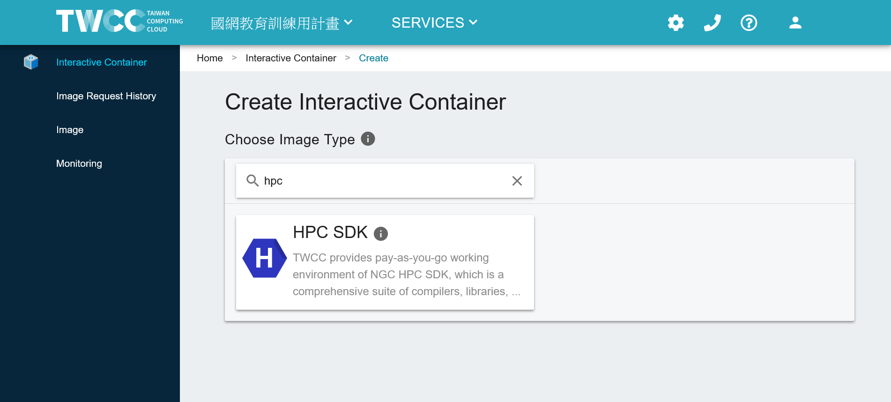
8. Select container image `nvhpc-24.5-devel-cuda_multi-ubuntu22.04:latest`, and then scroll down.
   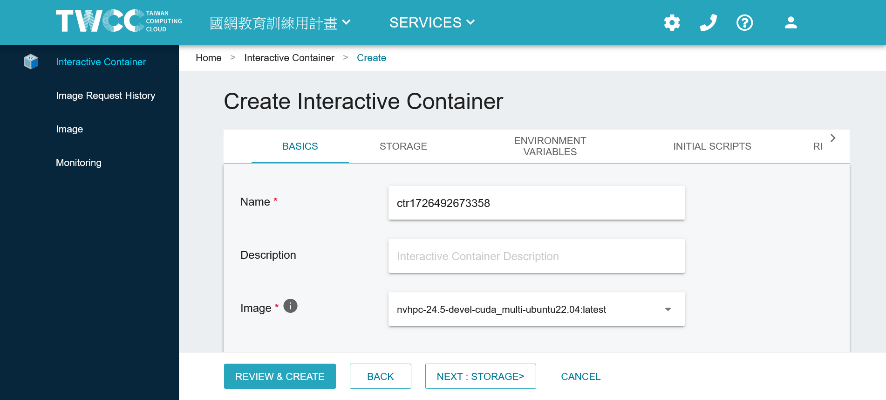
9. Select `c.super` (V100 GPU x1) for the configuration type, and click `REVIEW & CREATE`
   
10. Confirm again that you are using the correct wallet 「國網教育訓練用計畫」, and click `CREATE`.
    
11. Wait for the container to be initialized and ready. You can click `REFRESH` to check the status after a few minutes.  
    **WARNING**: After finishing the tutorial, make sure to check the container and click `DELETE` to avoid using up all your credits.
    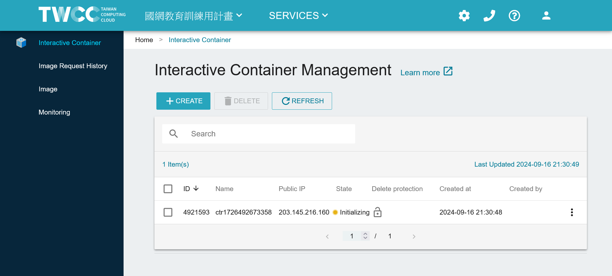
12. When the container shows `Ready`, click the container name to enter the details page.
    
13. Scroll down the container details page.
    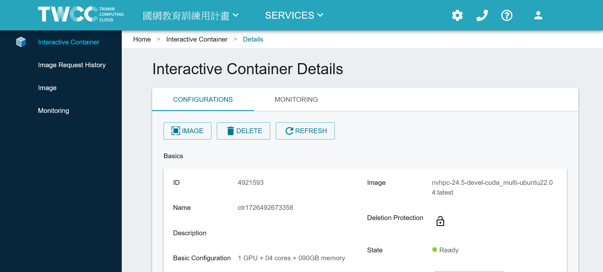
14. Click the `LAUNCH` button in the `Jupyter` row to open the Jupyter Notebook.
    
15. Click `New` and then `Terminal` to open a terminal.
    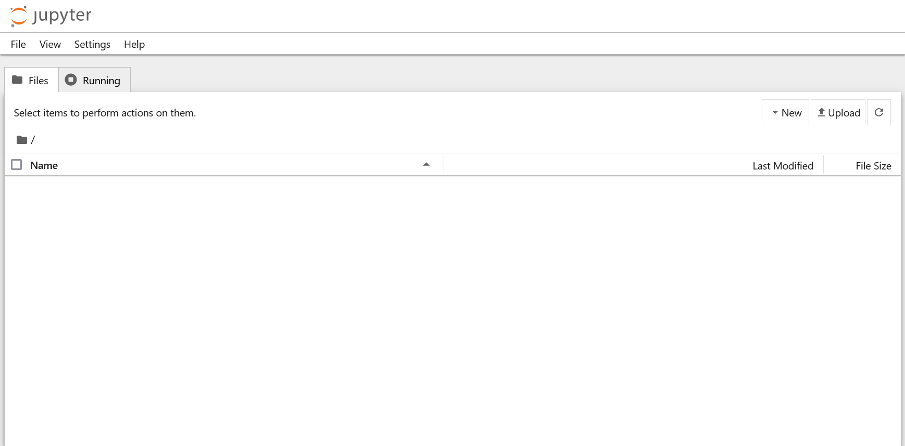
    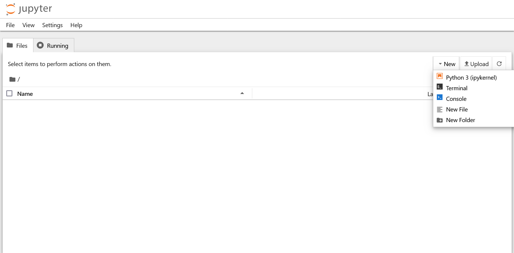
16. You can now run commands in the terminal.
    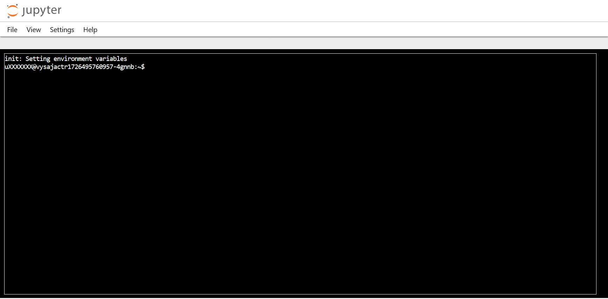

Related video: [TWCC 開發型容器-基本操作](https://youtu.be/LhqBdJK0PrY)

## Environment Setup

In the terminal, run:

```sh
# Clone the repository and link the workspace
cd ~
git clone https://github.com/j3soon/nways_accelerated_programming
sudo ln -s $HOME/nways_accelerated_programming/_basic /labs
sudo apt-get -y update && \
    DEBIAN_FRONTEND=noninteractive sudo apt-get -yq install --no-install-recommends python3-pip python3-setuptools nginx zip unzip make build-essential libtbb-dev python3-dev && \
    pip3 install --upgrade pip && \
    pip3 install gdown
python3 /labs/_common/dataset.py
# Download the N-WAY Bootcamp Challenges
cd /labs;
gdown 11L0M9ezG1O-wYCid67Qq3NGH1mCHYVPL
unzip nways_accelerated_programming_challenge-master.zip
# All done! Go back to Jupyter Notebook / Jupyter Lab
```

**Note**: To paste text in the jupyter terminal webpage, press `Ctrl+Shift+V`. To copy text, select the text, right-click, and choose `Copy`.

You should now see the `nways_accelerated_programming` folder in the Jupyter file browser.

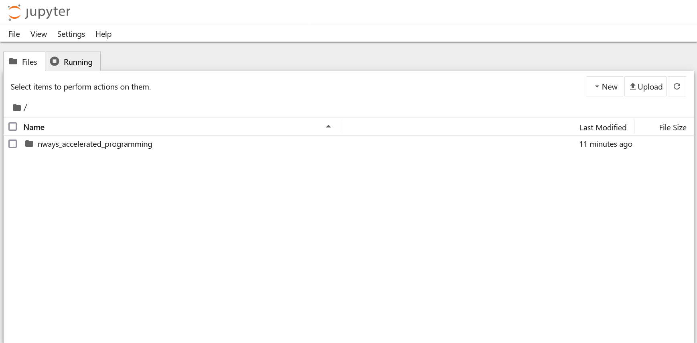

## Running the Notebooks

1. Navigate to `/nways_accelerated_programming/_basic` and open the `_start_nways.ipynb` notebook.

   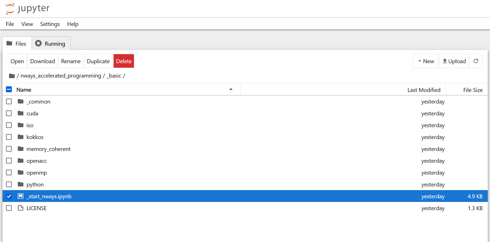

2. This will open the Jupyter Notebook GUI. Click the `JupyterLab` button at the top-right to open the Jupyter Lab GUI instead.

   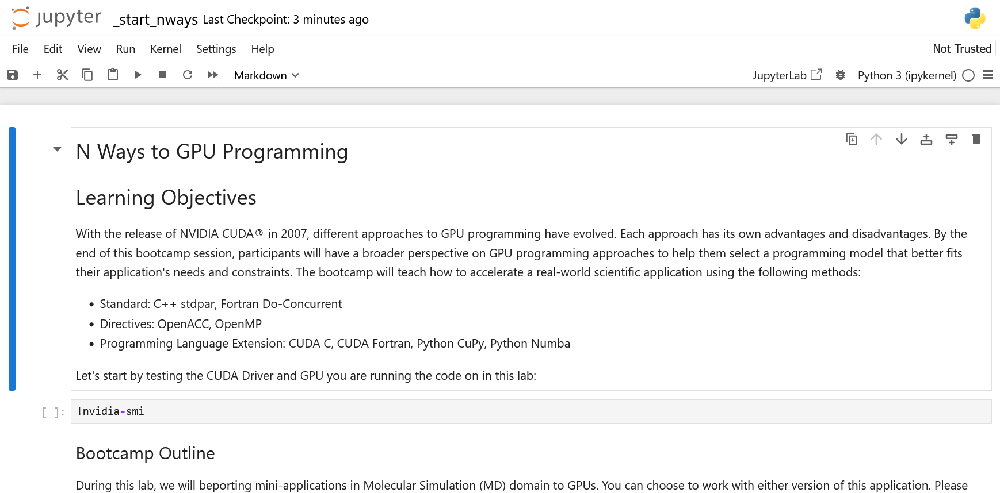

3. After switching to Jupyter Lab, you may observe that it is in the **Simple Interface** mode. Uncheck the `Simple` toggle at the bottom-left to switch to the **Multi document IDE** mode.

   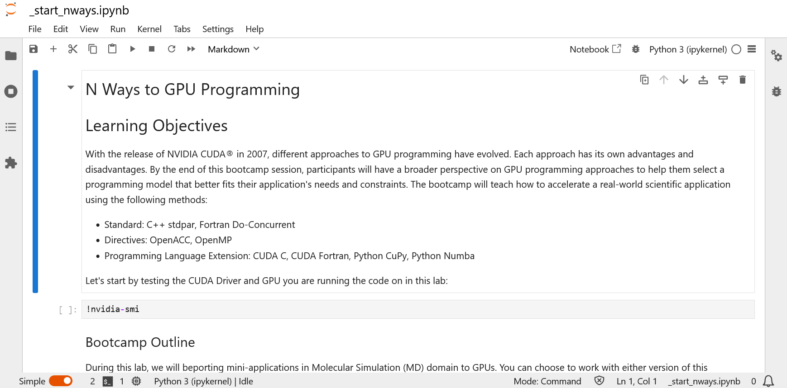

4. Congratulations! You are now ready to run the notebooks in Jupyter Lab **Multi document IDE** mode.

   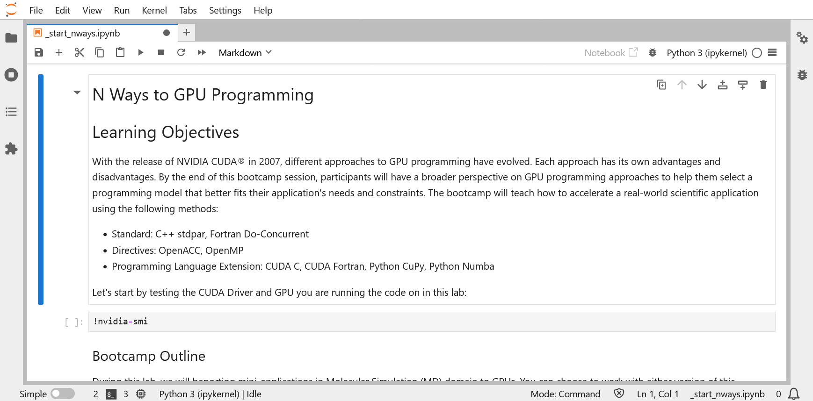

## Challenge

Open the `/nways_accelerated_programming/_basic/nways_accelerated_programming_challenge-master/nways_cfd/English/minicfd.ipynb` notebook.

## Deleting the Container

After you have finished the tutorial, make sure to delete the container to avoid using up all your credits.

The container list should be empty:


## Frequently Asked Questions (FAQ)

### Unexpected Errors During pip Install

If you have been using TWCC in the past, you may encounter unexpected errors during `pip install`. This is because TWCC mounts the user home directory automatically for ease of development. This will cause the package installed by `pip` to be stored under the `~/.local` directory. You can back up the `.local` directory and remove it:

```sh
mv ~/.local ~/.local.bak
mv ~/.bashrc ~/.bashrc.bak
```

and then delete and re-create the container (restarting the Jupyter kernel may not be enough).

After that, you should re-run the environment setup steps above (`rm`/`ln`/`chown`).

### Unable to Edit Files in Jupyter Notebook

If you open the C/C++ or Fortran files by clicking the code link in the Jupyter Notebook, you may not be able to edit the files.

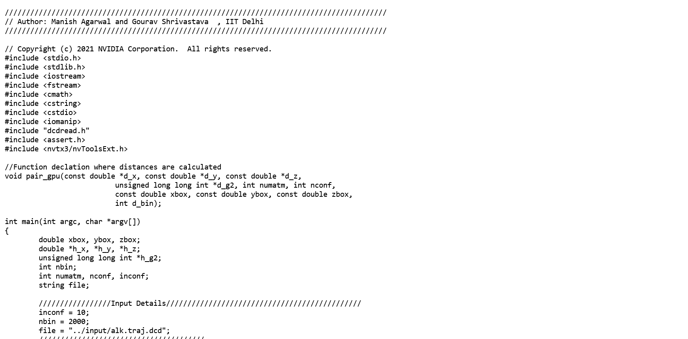

Please switch to Jupyter Lab **Multi document IDE** mode instead to allow easy editing of the files. Please follow the [Running the Notebooks](#running-the-notebooks) section above to switch to Jupyter Lab.

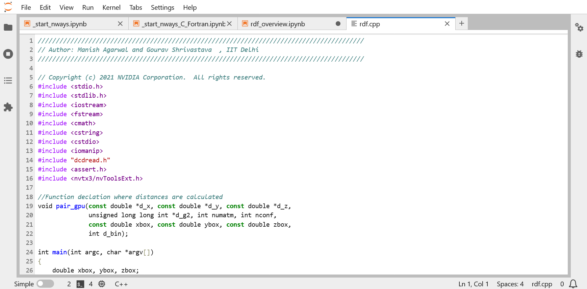

### Fortran Code Produces No Output

If your Fortran code produces no output, try replacing calls to `write(24,*)` with `print*,`,. This change seems to resolve the issue, though we haven't investigate the exact reason yet.

### Disk Quota Exceeded

This may happen if you are using TWCC in the past and have somehow end up with zero disk quota due to no subscribed projects.

Example error message:

```
~$ git clone https://github.com/j3soon/nways_accelerated_programming
Cloning into 'nways_accelerated_programming'...
error: copy-fd: write returned: Disk quota exceeded
fatal: cannot copy '/usr/share/git-core/templates/hooks/fsmonitor-watchman.sample' to '/home/uXXXXXXX/nways_accelerated_programming/.git/hooks/fsmonitor-watchman.sample': Disk quota exceeded
```

Click `VIEW DETAILS` in the user dashboard and check if the `Total Storage` quota is below `100GiB`. If so, you indeed stumbled upon this disk quota issue. The `HFS Portal` should show similar results.

> If the `Total Storage` quota is equal or above `100GiB`, you simply need to remove unnecessary files to free up disk space.


Follow the steps below to resolve the issue:

1. Keep the used disk space below 100 GB for both `Home` and `Work` directories by removing unnecessary files.

   

2. In the `HFS User Portal`, click `Change Project` and apply the `國網教育訓練用計畫` project.

   
   
   

3. The disk quota should be restored to 100 GB. You may need to wait a while for the disk quota information to be updated.

   
   

### Interactive Container Not Showing Up

If you encountered the following issue where the **Interactive Container** service isn't showing up, wait for a while and it should show up within a few minutes.

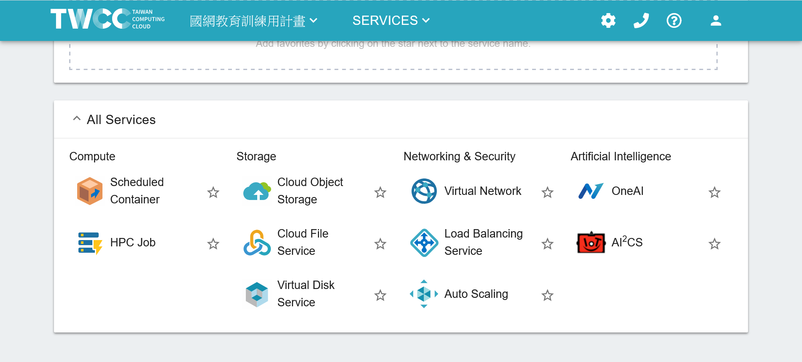

### Unexpected Errors During sudo

If you encountered the following error message when running `sudo rm -rf /workspace`:

```
env: ‘rm’: Permission denied
```

This may be due to the `sudo` alias in `~/.bashrc` being added when installing conda. You can remove the alias by commenting the following line in `~/.bashrc`:

```
# alias sudo='sudo env PATH=$PA'
```

and then open a new terminal or run `source ~/.bashrc`.
